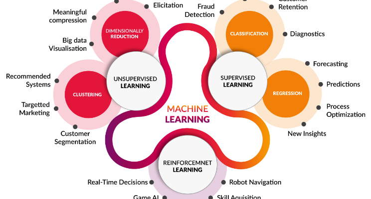

# Data Science and Machine Learning

This repository contains two excellent courses. I knit it in the same repo because they are both Machine Learning courses.  
- INDE577-Data Science and Machine Learning. Offered by Rice University. Instructor: Dr. Randy R. Davila.   [Youtube](https://www.youtube.com/c/drrandydavila)
- ML Specialization. Offered by Stanford University.   Instructor: Dr. Andrew Ng.    [Coursera](https://www.coursera.org/specializations/machine-learning-introduction?utm_medium=sem&utm_source=gg&utm_campaign=B2C_NAMER_machine-learning-introduction_stanford_FTCOF_specializations_country-US&campaignid=685340575&adgroupid=146515176429&device=c&keyword=&matchtype=&network=g&devicemodel=&adposition=&creativeid=650958766230&hide_mobile_promo&gclid=Cj0KCQjwiZqhBhCJARIsACHHEH9nwJVzEpaVfK2pcMPZfVVcVQuOmHyVZQU0ldwW-6g3w31bffWwYKMaAiX6EALw_wcB)  

## Resources and Textbooks (Citations are mainly from this part)
1. Dr. Randy Davila's Github and Youtube Vedio
2. Cousera Machine learning specialization series
3. Hands-On Machine Learning with Scikit-Learn, Keras, and TensorFlow, 2nd Edition, by Aurélien Géron  
4. Machine Learning with Python for Everyone, Addison Wesley Data & Analytics Series, 2020 Pearson Education, by Mark E. Fenner   

## Programming language and tools:
Python, VS Code, Jupyter Notebooks  

## Content 
- [**Basic codes / Class / Important Packages**](https://github.com/Luluiscoding/updating-Data-Science-and-Machine-Learning/blob/main/Basic%20codes%20in%20Python/Basic%20codes%20in%20Python.ipynb)  
- **Supervised Learning:**
1. [Model Building and Error Analysis](https://github.com/Luluiscoding/updating-Data-Science-and-Machine-Learning/blob/main/Supervised%20Learning/Evaluate%20the%20Model.ipynb)
2. [Gradient Descent](https://github.com/Luluiscoding/updating-Data-Science-and-Machine-Learning/blob/main/Supervised%20Learning/Gradient%20Descent.ipynb)
3. [Linear Regression](https://github.com/Luluiscoding/updating-Data-Science-and-Machine-Learning/blob/main/Supervised%20Learning/Linear%20Regression.ipynb)
4. [Logistic Regression](https://github.com/Luluiscoding/updating-Data-Science-and-Machine-Learning/blob/main/Supervised%20Learning/Logistic%20Regression.ipynb)
5. [Perceptron](https://github.com/Luluiscoding/updating-Data-Science-and-Machine-Learning/blob/main/Supervised%20Learning/Perceptron.ipynb)
6. [Support Vector Machines](https://github.com/Luluiscoding/updating-Data-Science-and-Machine-Learning/blob/main/Supervised%20Learning/Support%20Vector%20Machines.ipynb)
7. [k-Nearest Neighbors](https://github.com/Luluiscoding/updating-Data-Science-and-Machine-Learning/blob/main/Supervised%20Learning/K-Nearest%20Neighbors(KNN).ipynb)
8. [Decision and Regression Trees](https://github.com/Luluiscoding/updating-Data-Science-and-Machine-Learning/blob/main/Supervised%20Learning/Decision%20Tree.ipynb)
9. [Ensemble Learning  ](https://github.com/Luluiscoding/updating-Data-Science-and-Machine-Learning/blob/main/Supervised%20Learning/Ensemble%20Methods.ipynb)
- **Unsupervised Learning:**
1. [k-Means Clustering](https://github.com/Luluiscoding/updating-Data-Science-and-Machine-Learning/blob/main/Unsupervised%20Learning/K-Means%20Clustering.ipynb)
2. [k-Means Clustering Coding](https://github.com/Luluiscoding/updating-Data-Science-and-Machine-Learning/blob/main/Unsupervised%20Learning/K-Means%20Clustering%20Coding.ipynb)
- **Recommender System:**
1. [Principle Component Analysis](https://github.com/Luluiscoding/updating-Data-Science-and-Machine-Learning/blob/main/Recommender%20System/Principle%20Component%20Analysis(PCA).ipynb)
2. [PCA Visualization](https://github.com/Luluiscoding/updating-Data-Science-and-Machine-Learning/blob/main/Recommender%20System/PCA%20Visualization.ipynb)
- [**Reinforcement Learning**](https://github.com/Luluiscoding/updating-Data-Science-and-Machine-Learning/blob/main/Reinforcement%20Learning/Reinforcement%20Learning.ipynb)  
